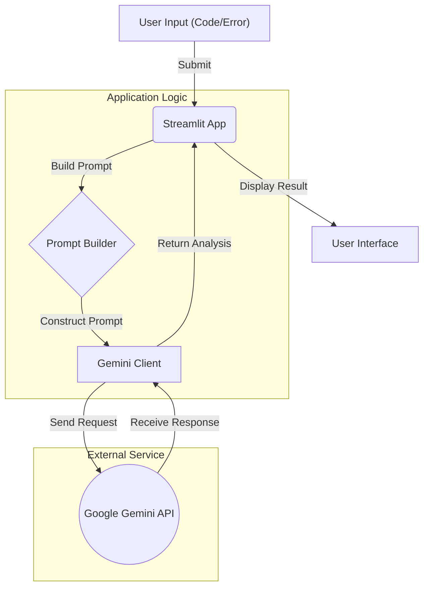

# AI Debugging Assistant

A powerful, AI-driven assistant designed to help developers debug their code and analyze error logs. Built with Python and Streamlit, it leverages Google's Gemini API to provide intelligent explanations and solutions.

## Features

*   **Code Analysis:** Paste your Python code to get instant feedback and debugging suggestions.
*   **Error Log Interpretation:** Submit error logs to understand the root cause of issues.
*   **Intelligent Explanations:** Receive clear, concise explanations powered by the Gemini 2.0 Flash model.
*   **User-Friendly Interface:** Simple and clean UI built with Streamlit.

## Architecture

Here is a high-level overview of how the AI Debugging Assistant works:



## Prerequisites

*   Python 3.10 or higher
*   A Google Cloud Project with the Gemini API enabled
*   An API Key for Google Gemini

## Installation

1.  **Clone the repository:**
    ```bash
    git clone https://github.com/your-username/ai-debugging-assistant.git
    cd ai-debugging-assistant
    ```

2.  **Create and activate a virtual environment:**
    ```bash
    python -m venv venv
    source venv/bin/activate  # On Windows use `venv\Scripts\activate`
    ```

3.  **Install dependencies:**
    ```bash
    pip install -r requirements.txt
    ```

4.  **Set up environment variables:**
    Create a `.env` file in the root directory and add your Gemini API key:
    ```env
    GEMINI_API_KEY=your_api_key_here
    ```

## Usage

To run the application, use the following command from the root directory:

```bash
streamlit run apps/debugging_assistant/app.py
```

The application will open in your default web browser at `http://localhost:8501`.

## Project Structure

```
.
├── apps/
│   └── debugging_assistant/
│       ├── app.py          # Main Streamlit application
│       └── prompts.py      # (Optional) Application-specific prompts
├── config/
│   ├── config.yaml         # Configuration settings
│   └── model_config.py     # Pydantic models for configuration
├── utils/
│   ├── debugging_helper.py # Helper functions for debugging logic
│   ├── llm_client.py       # Client for Google Gemini API
│   └── prompts/            # JSON prompt templates
├── .env                    # Environment variables (not committed)
├── requirements.txt        # Project dependencies
└── README.md               # Project documentation
```

## Configuration

You can customize the application behavior by modifying `config/config.yaml`:

```yaml
model:
  name: "gemini-2.0-flash"
  temperature: 0.4
  top_p: 1.0
  max_output_tokens: 2048

debugging_app:
  explanation_language: "en"
  max_code_chars: 4000
```

## License

This project is licensed under the MIT License.
